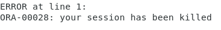
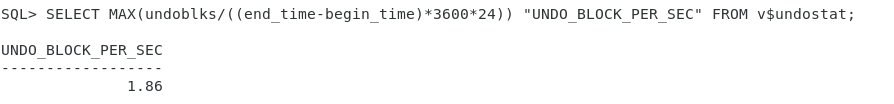
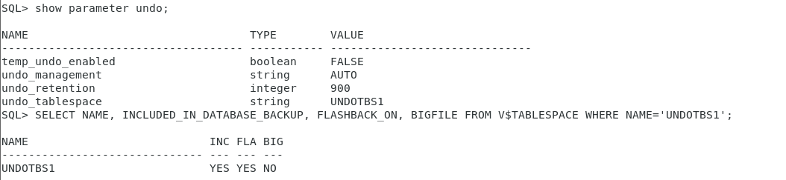

# Разрешить блокировку двумя способами
```SQL
SQL1 > UPDATE sample SET value 3 WHERE id=1;

1 row updated.
```
Второй клиент зависает


## 1. Зафиксировать/откатить изменения
```SQL
SQL1> COMMIT;
-- Или
SQL1> ROLLBACK;
```
## 2. Убить сессию
Узнаем свой SID и SID второй сессии. Убиваем вторую сессию:


Вторая сессия получает сообщение:



# Создать deadlock на таблице
```SQL
-- Создаем deadlock
SQL1> UPDATE sample SET value=1 WHERE id=1;
-- row updated
SQL2> UPDATE sample SET value=1 WHERE id=2;
-- row updated
SQL1> UPDATE sample SET value=2 WHERE id=2;
-- зависание
SQL2> UPDATE sample SET value=2 WHERE id=1;
-- зависание
```


[alert.log](alert.log)
# Управление сегментами отмены

## 1. Совершить длительную транзакцию (10000 записей и более) и проанализировать статистику отмены (V$UNDOSTAT): количество использованных блоков сегментов Undo, максимальная длительность запросов.


## 2. С использованием 1) вычислить размер табличного пространства отмены для поддержки 1-часового undo retention interval.



Undo Size = Optimal Undo Retention * DB_BLOCK_SIZE * UNDO_BLOCK_REP_ESC = 60*60 * 16384 * 1.86 = 104 Мб

## 3.  Продемонстрировать настроенные параметры для UNDO, аттрибуты табличного пространства для UNDO, установленные по-умолчанию для вашей системы


## 4. Изменить настройки табличного пространства отмены для поддержки 1-часового гарантированного интервала хранения

