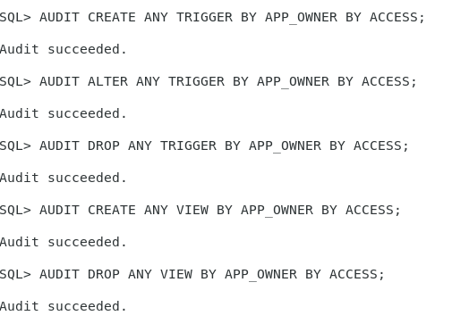

## 1.  Включить стандартный, детализированный аудит Oracle, запись в базу.
init.ora:
```
...
audit_trail=db,extended
...
```


    
## 2.  Для пользователя "владелец приложения" из #2 аудировать:  

 - Все действия по созданию/изменению триггеров и представлений БД. Каждое изменение - отдельной записью 
 - Фиксировать только неудачные попытки удаления из таблиц вашим пользователем. Одна запись на сессию. 
    
## 3.  sql запрос: показать содержимое журнала аудита для стандартного аудита

