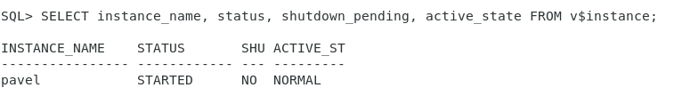
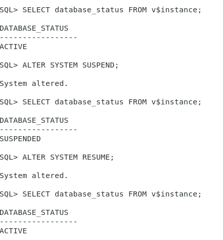
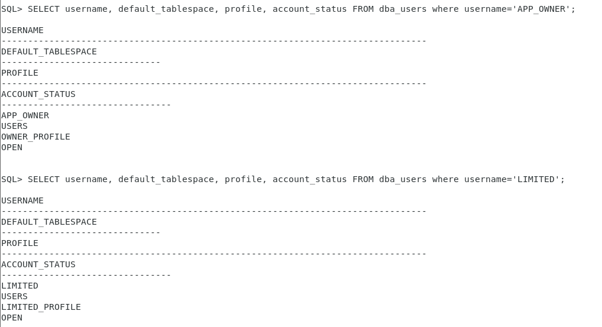

## 3. Скрипты
[Скрипты](scripts.zip)
## 4. Вывод из словаря $v

## 5. Создать SPFILE
```SQL
SQL> CREATE SPFILE FROM PFILE='initpavel.ora';
```
[SPFILE](spfilepavel.ora)
## 6. Изменить параметр системы
```SQL
SQL> ALTER SYSTEM SET open_cursors=350 SCOPE=MEMORY;
```


## 7. Варианты монтирования и остановки БД
```SQL
-- Read-only
SQL> SHUTDOWN NORMAL;
SQL> STARTUP MOUNT;
SQL> ALTER DATABASE OPEN READ ONLY;
```
```SQL
-- Enable/disable restrict
SQL> ALTER SYSTEM ENABLE RESTRICTED SESSION;
SQL> ALTER SYSTEM DISABLE RESTRICTED SESSION;
```
```SQL
SQL> SHUTDOWN NORMAL; -- Второй пользователь отсоединяется и только после этого база выключается
SQL> SHUTDOWN TRANSACTIONAL; -- После выполнения команды COMMIT вторым пользователем экземпляр
SQL> SHUTDOWN IMMEDIATE; -- Второй пользователь получается сообщение ORA-12152: TNS: Unable to send break message

SQL> SHUTDOWN ABORT;
SQL> STARTUP MOUNT;
SQL> RECOVER DATABASE;
```
## 8. Перевести в SUSPEND и обратно

## 9. Изменение параметров
```SQL
SQL> alter system set optimizer_mode = rule scope=spfile;
SQL> select value from v$parameter where name='optimizer_mode'
union all
select value from v$spparameter where name='optimizer_mode';
```

Изменения не были сохранены в spfile, поэтому действительны только для текущего экземпляра.
## 10-12. Создать профили, пользователей и применить профили к пользователям
```SQL
/* 
владелец приложения: 
без квоты на создание объектов, без ограничений по времени сессии,  
количеству сессий, роли для просмотра словаря данных и динамических представлений
*/
SQL> CREATE PROFILE owner_profile LIMIT SESSIONS_PER_USER UNLIMITED CONNECT_TIME UNLIMITED;
SQL> CREATE USER APP_OWNER IDENTIFIED BY 111; 
SQL> ALTER USER APP_OWNER PROFILE owner_profile;
SQL> GRANT UNLIMITED TABLESPACE TO APP_OWNER;
SQL> GRANT SELECT_CATALOG_ROLE TO APP_OWNER;
```
```SQL
/*
ограниченный: квота 50М, 15 мин простоя сессии, макс 2 сессии, без доступа к словарю данных
*/
SQL> CREATE PROFILE limited_profile LIMIT SESSIONS_PER_USER 2 IDLE_TIME 900;
SQL> CREATE USER LIMITED IDENTIFIED BY 222;
SQL> ALTER USER LIMITED PROFILE limited_profile;
SQL> ALTER USER LIMITED QUOTA 50M ON USERS;
```


## 13. Установить профиль b по умолчанию
```SQL
SQL> ALTER PROFILE DEFAULT LIMIT SESSIONS_PER_USER 2 IDLE_TIME 900;
```
