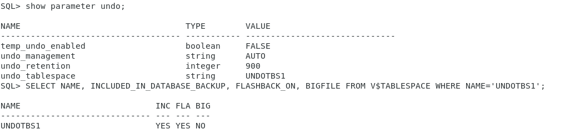

## Блокировка

Предположим, у нас есть блокировка

```SQL
SQL> UPDATE test_table SET data=123 WHERE id=1;
```

```SQL
/*Эта строка вызывает зависание/*
SQL1> UPDATE test_table SET data=321 WHERE id=1;
```

и здесь у нас 2 варианта: 

1. сделать `commit` либо `rollback`. Первая опция зафиксирует изменения, а вторая их отменит.

```sql
SQL1> commit;
/*или*/
SQL1> rollback;
```

2. убить сессию
https://www.oracle.com/ocom/groups/public/@otn/documents/webcontent/283689.htm

```SQL
SQL> SELECT sess.sid, sess.serial# FROM gv$session sess WHERE sess.type != 'BACKGROUND";

SQL> ALTER SYSTEM KILL SESSION '33,2098';
```

## Deadlock

```SQL
SQL1> UPDATE sample SET data=1 WHERE id=1;
-- Транзакция произошла
SQL2> UPDATE sample SET data1 WHERE id=2;
-- Транзакция произошла
SQL1> UPDATE sample SET data=2 WHERE id=2;
-- Не прошла
SQL2> UPDATE sample SET data=2 WHERE id=1;
-- Не прошла
```

## Управление сегментами отмены

#### 1. Совершить длительную транзакцию (10000 записей и более) и проанализировать статистику отмены (V$UNDOSTAT): количество использованных блоков сегментов Undo, максимальная длительность запросов.


#### 2. С использованием 1) вычислить размер табличного пространства отмены для поддержки 1-часового undo retention interval.


`Undo Size = Optimal Undo Retention * DB_BLOCK_SIZE * UNDO_BLOCK_REP_ESC = 60*60 * 16384 * 1.86 = 104 Мб`

#### 3.  Продемонстрировать настроенные параметры для UNDO, аттрибуты табличного пространства для UNDO, установленные по-умолчанию для вашей системы


#### 4. Изменить настройки табличного пространства отмены для поддержки 1-часового гарантированного интервала хранения


