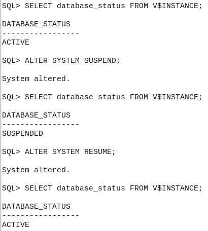
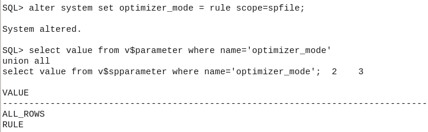

## -Шаблон БД и скрипты создания

[Скрипты](scripts.zip)

## -Вывод из словаря данных:


## -SPFILE 

[SPFILE](spfileoracleadm.ora)

## -System parameters:
```SQL
SQL> ALTER SYSTEM SET open_cursors=400 SCOPE=MEMORY;
```


## -Монтирование и остановка:
```SQL
SQL> SHUTDOWN NORMAL;
SQL> STARTUP MOUNT;
SQL> ALTER DATABASE OPEN READ ONLY;
/* read only*/
```

```SQL
SQL> ALTER SYSTEM ENABLE RESTRICTED SESSION;
SQL> ALTER SYSTEM DISABLE RESTRICTED SESSION;
/* restrict & back */
```


```SQL

SQL> SHUTDOWN NORMAL; /* второй отключается -> база отключается */
SQL> SHUTDOWN TRANSACTIONAL; /* экземпляр после commit второго отключается */
SQL> SHUTDOWN IMMEDIATE; /* ORA-12152: TNS: Unable to send break message. - получает 2ой */
SQL> SHUTDOWN ABORT;
SQL> STARTUP MOUNT;
SQL> RECOVER DATABASE;
Media recovery complete.
/* Подключены 2 пользователя, второй выполняет shutdown */
```

## -Suspend & back



## -Change parameters
```SQL
SQL> alter system set optimizer_mode = rule scope=spfile;
select value from v$parameter where name='optimizer_mode'
union all
select value from v$spparameter where name='optimizer_mode';
```



Т.к. измененный параметр не был сохранен в spfile, они действительны только для текущего экземпляра.

## -Профили, пользователи
```SQL
SQL> CREATE PROFILE app_owner_prof LIMIT SESSIONS_PER_USER UNLIMITED CONNECT_TIME UNLIMITED;
SQL> CREATE USER APP_OWNER IDENTIFIED BY 12345678;
SQL> ALTER USER APP_OWNER PROFILE app_owner_prof;
SQL> GRANT UNLIMITED TABLESPACE TO APP_OWNER;
SQL> GRANT SELECT_CATALOG_ROLE TO APP_OWNER;
/* 1.	владелец приложения: нет квоты на создание объектов, нет ограничений по времени сессии и  количеству сессий, роли для просмотра словаря данных и динамических представлений */
```

```SQL
SQL> CREATE PROFILE limited_prof LIMIT SESSIONS_PER_USER 2 IDLE_TIME 900;
SQL> CREATE USER LIMITED IDENTIFIED BY 12345678;
SQL> ALTER USER LIMITED PROFILE limited_prof;
SQL> ALTER USER LIMITED QUOTA 50M ON USERS;
/* 2.	ограниченный: квота 50 М, 15 мин простоя сессии, макс 2 сессии, без доступа к словарю данных */
```

## -User in dba_users, user profile parametres 


## -Профиль 2 - по-умолчанию для новых пользователей
```SQL

SQL> ALTER PROFILE DEFAULT LIMIT SESSIONS_PER_USER 2 IDLE_TIME 900;
```


## -New user

```SQL
SQL> CREATE USER TEST_USER IDENTIFIED BY 12345678;
SQL> SELECT profile FROM dba_users WHERE username='TEST_USER';
PROFILE
--------------------------------------------------------------------------------
DEFAULT
```